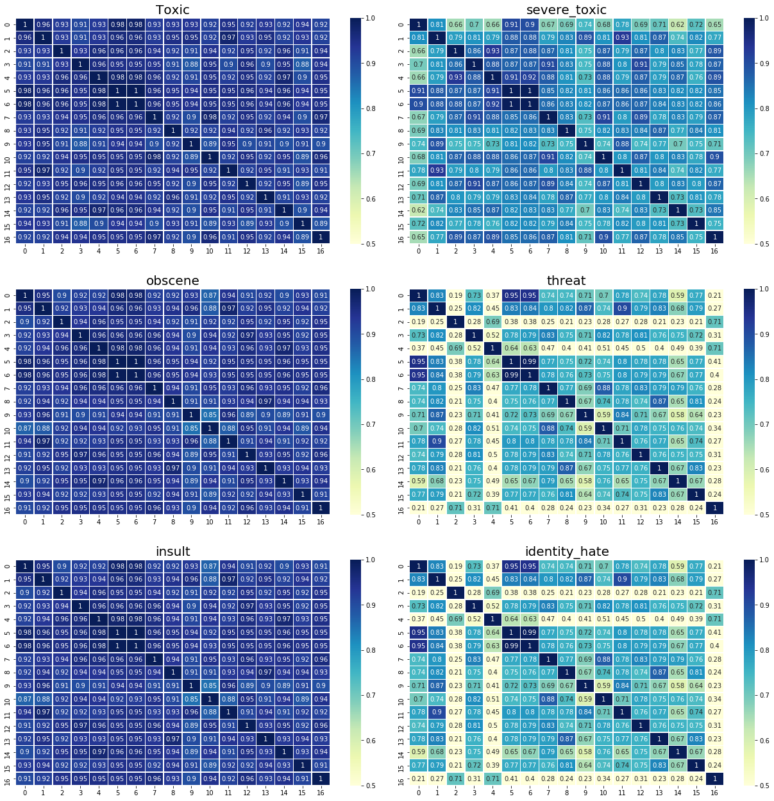

## Others' scripts!
_______

Let's learn from others!!! Always excited to learn :D

## (1) Logistic Regression
### 01 (0.9772)
- TF-IDF
- Naive Bayes

### 03 (0.9792)
- TF-IDF
- Cross-validation

~~### 19 (0.9748)~~ (super fast script. i like it)

### 25 (0.9765) ** the private score for this kernel is ~0.9786
- Stemmer
- Lemmatizer
- Cross-validation
- TF-IDF

## (2) LSTM
~~### 04 (0.9657) -~~
~~Tokenizer - Bidirectional LSTM (epoch=1,batch=32) ~~
(almost same to ##7, but no glove.6B.50D)

~~### 05 (0.9649)~~
~~- Tokenizer~~
~~- normal LSTM (epoch=1, batch=32)~~
(almost same to ##04, but not using Bidirectional LSTM)

### 07 (0.9768)- using glove.6B.50d.txt --> let's try to use glove.840b.300d.txt
- Tokenizer- pad_sequence
- Bidirectional LSTM (epoch=2, batch=32)~~
(almost same to #34, without one layer BatchNormalization()(x)

### 34 (0.9770)- using glove.6B.50d.txt --> let's try to use glove.840B.300d.txt
- Tokenizer
- pad_sequence
- Bidirectional LSTM (epochs=3, batch=64)

## (3) GRU
### 06 (0.9828)
- using crawl-300d-2M.vec
- Tokenizer
- sequence
- Bidirectional GRU (batch=32,epoch=2)

### 15 (0.9839)
- using glove.840B.300d
- Tokenizer
- pad-sequence
- Bidirectional GRU + CONV1D (batch=128, epoch=4)

~~### 20 (0.9837)- using glove.840B.300d Bidirectional GRU (batch=128, epoch=4)~
(almost same to 15)

## (4) CNN
### 26 (0.9820)
- using crawl_300d_2M
- CONV2D (batch=256, epoch=3)

### 40 (0.9775)
- Tokenizer
- pad_sequence
- CONV1D (batch=128, epoch=4)

## (5) Light GBM
### 18 (0.9792)
- TF-IDF

### 33 (0.9790)
- TF-IDF

## (6) XGBOOST
### 36 (0.9728)
- feature engineering

## (7) ExtraTreeClassifier
### 9 (0.9814)
- ensemble with other results (1 + 7)
